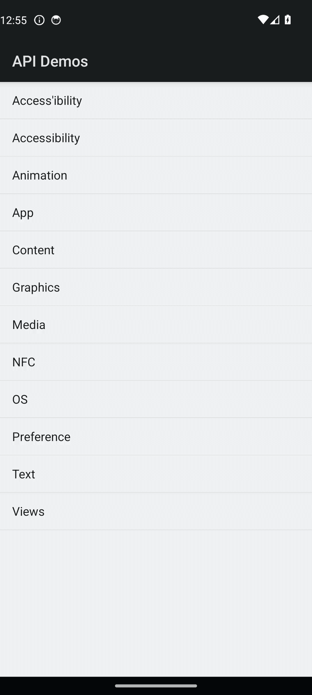

# Mobile Testing — Demo Artifacts

End-to-end demo of Roost's agentic mobile test generation pipeline, running against the
[Appium Android ApiDemos](https://github.com/appium/appium/tree/master/sample-code/apps) app.

## The flow

<p align="center">
  
</p>

The agent reads a plain-English scenario, explores the app on a real device, and
produces both flat pytest tests and a Page Object Model (POM) test suite — along with
a Gherkin feature file and a screen recording of the executed run.

## The scenario

The natural-language input handed to the agent ([`scenarios/android-api-demo.txt`](scenarios/android-api-demo.txt)):

```text
Open the ApiDemos app.
Scroll down and tap on "Views" from the main menu list.
Scroll down and tap on "Buttons" from the Views submenu.
Verify the Buttons screen is displayed with different button styles (Normal, Small, Toggle).
Tap the "Toggle" button and verify it changes state.
Go back to the Views list.
Go back to the main ApiDemos screen.
```

## Contents

| Path | What it is |
| --- | --- |
| [`scenarios/android-api-demo.txt`](scenarios/android-api-demo.txt) | The natural-language user scenario fed to the agent. |
| [`generated_tests/.../scenarios/*.feature`](generated_tests/io.appium.android.apis/appium_tests/scenarios/features) | Gherkin feature file generated from the scenario. |
| [`generated_tests/.../scenarios/*.json`](generated_tests/io.appium.android.apis/appium_tests/scenarios) | Structured scenario plan with detailed steps. |
| [`generated_tests/.../tests/`](generated_tests/io.appium.android.apis/appium_tests/tests) | Flat pytest + Appium test suite. |
| [`generated_tests/.../pom_tests/`](generated_tests/io.appium.android.apis/appium_tests/pom_tests) | Page Object Model variant of the same suite. |
| `generated_tests/.../recordings/test_recording.mp4` | Screen recording captured during the actual test execution. |
| [`generated_tests/.../.roost/metadata.json`](generated_tests/io.appium.android.apis/appium_tests/.roost/metadata.json) | Run metadata: agent outcome, generated files, execution status. |
| [`sample_apps/ApiDemos-debug.apk`](sample_apps/ApiDemos-debug.apk) | The Android ApiDemos build under test — bundled so the repo is self-contained. |
| [`config/mobile-app.env.template`](config/mobile-app.env.template) | Top-level config template for the Roost mobile test generator (AI provider, Appium server, scenario path, etc.). |

Both `tests/` and `pom_tests/` executed successfully against the device — see
`.roost/metadata.json` (`test_executed_success: true`, `pom_test_executed_success: true`).

## Running the generated tests

```bash
cd generated_tests/io.appium.android.apis/appium_tests/tests   # or pom_tests/
python -m venv .venv && source .venv/bin/activate
pip install -r requirements.txt
cp .env.template .env                                          # then edit values
pytest -v
```

`.env` is gitignored — copy from `.env.template` and fill in your Appium server URL,
device name, and (if needed) unlock credentials. No real credentials are committed.
